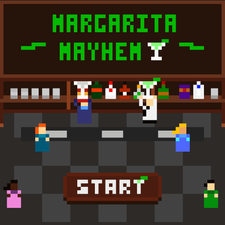
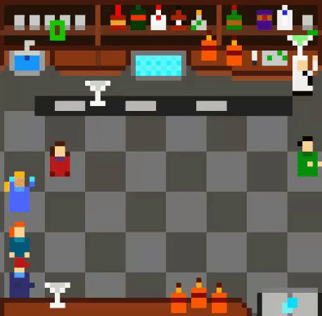

## Margarita Mayhem

Solo-dev submission for [Low Rez Jam 2025](https://itch.io/jam/lowrezjam-2025) built in a single week.

Check out the web demo! https://plyr4.github.io/margarita-mayhem/

### About the game

Margarita Mayhem puts you into the shoes of a barback, a bartender's right-hand. And left.

Your job is to keep the bar stocked and the drinks flowing. Keep the bar clean and the customers happy.

**Controls**:

- **WASD/ARROW** keys to control your character
- **WASD/ARROW** keys to pick things up
- **WASD/ARROW** keys to put things down

## Development

### Tools & Software

- Music and Sfx created using [Sonic Pi](https://sonic-pi.net/).
- Art created using [Asperite](https://www.aseprite.org/)
- Animations created using [DOTween (free)](https://dotween.demigiant.com/).

## Installation

### Requirements

- [Unity 2022.3.25f1](https://unity.com/releases/editor/archive)

### How to run

This folder contains the entire Unity project for Margarita Mayhem and all assets required to run and build the game.

Install [Unity 2022.3.25f1](https://unity.com/releases/editor/archive) and add this directory as a project.

Open the core game scene `Assets/Scenes/Game.unity`.

Hit play!
